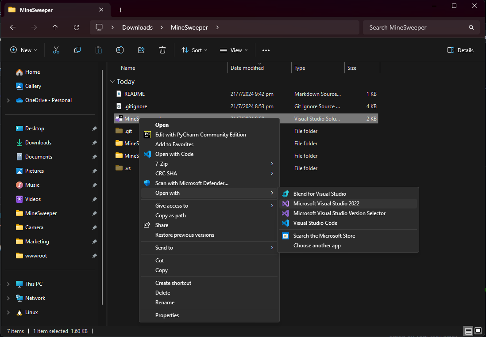
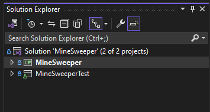
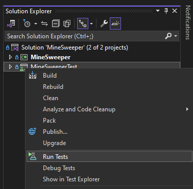
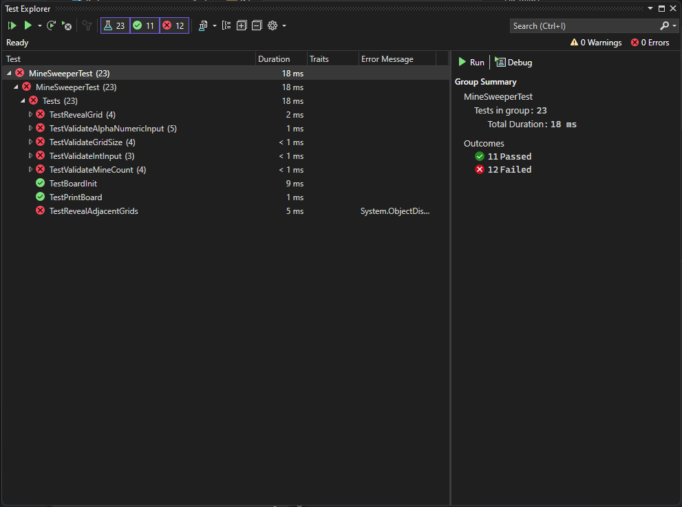
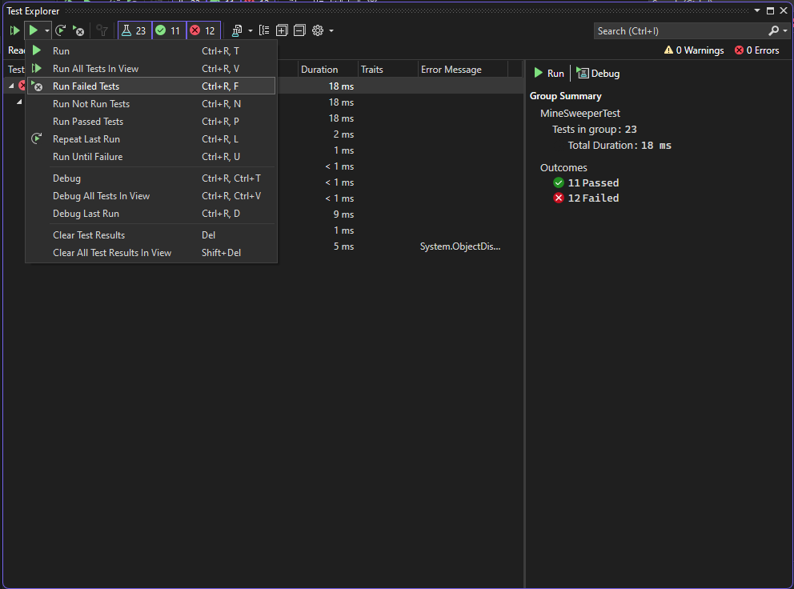
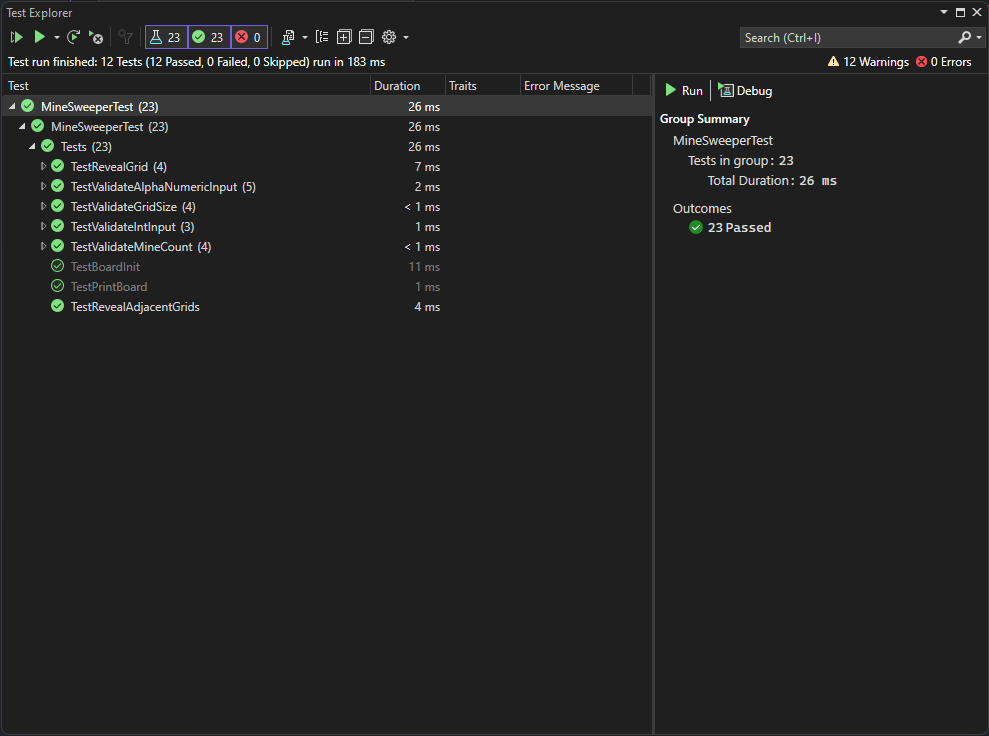
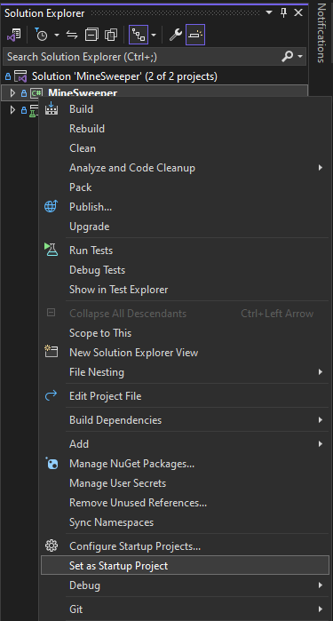
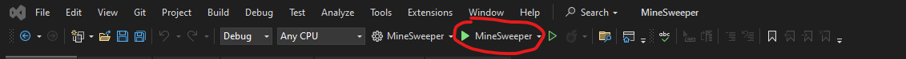
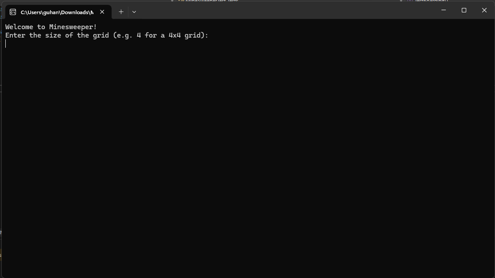

# MineSweeper

This project is a simple MineSweeper game built using C# and .Net(8.0) console application. The recommended IDE to run and test this application code is Visual Studio 2022 and the recommended environment/OS is Windows. This application is built using TDD (test driven development) principles and the unit test library used is NUnit.

## Steps to run code

1. Clone the repo into you local machine.
2. Open the `MineSweeper.sln` file using Visual Studio 2022.

   
3. Once the solution is loaded in Visual Studio, you will see 2 projects in the `Solution Explorer` panel.

   
4. Right click on the `MineSweeperTest` project and select `Run Tests`

   
5. Initial test run will show an output as seen below,

   
6. This is suspected to be an issue with VIsual Studio 2022 as running the test again by selecting the `Run Failed Tests` option seem to fix it.

   

   
7. Once all the unit tests are passed, we can move on to running the application.
8. Right click on the `MineSweeper` project in the `Solution Explorer` panel and select `Set as Startup Project` option.

   
9. Once `MineSweeper` project is set as the startup project, you will now see MineSweeper next to a green play button in you top panel of Visual Studio as shown below.

   
10. Clicking this button will run the application in a console window.

    

## Design considerations and recommendations

This application is built using OOP design principles. The `Models` folder (encapsulation) consists of the fundamental building blocks of the application `Board` and `Grid`. These classes are the blueprint of the bojects based on which the game logic is possible. The business logic of the application is defined in the `Utils` folder which contains the application specific utilities methods.

Even though this solution is build using TDD approach, unit testing alone is not recommended for a production ready application. Additionaly, it would be ideal to perform UAT and regression tests on the code to ensure more production readiness.
